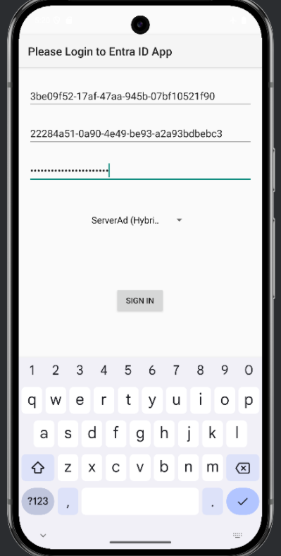
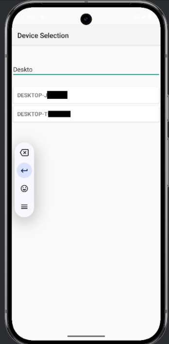

# LAPSFieldTool_v2
This is an Android app utilizing the Microsoft Graph API to retrieve LAPS (Local Administrator Password Solution) passwords stored in Entra ID.

Prerequisites:
1. You will need to set up an app in Entra ID and give it these 2 permissions:
Device.Read.All
DeviceLocalCredential.Read.All

2. Then, you will need to take note of the "client ID" and the "tenant ID" which should be accessible on the app info page accessible via the ApplicationMenuBlade in Entra ID.

3. Then, you will need to add a "client secret" to the app, under the link next to "client credentials" (also accessible on the app info page.)
Note that certificate login is not supported.

How it works: You will supply the tenant ID, client ID of your Entra ID app, and the client secret in the login form.
From the dropdown, you will select "ServerAd" for a hybrid Azure / AD environment, or "AzureAd" for a cloud-only environment.
After you press the login button, the app will log in to MicrosoftOnline.com (i.e., getting a bearer token from that API endpoint.)
Upon a successful first login, the device should remember your client ID and tenant ID.
It will automatically retrieve a list of devices from Entra ID using the Microsoft Graph API (it's a new API request every 100 devices, and follows the @odata.nextLink automatically.)
You will be able to filter the device list by device name using the search bar.

Once you click a device, the app will query the Microsoft Graph API to get the list of LAPS passwords for that specific device (with their last backup date.) (The API gives passwords in base 64, the app will decode these for you.)
Note: It should also redirect you to the login activity again after the bearer token expires (which is usually 1 hour or 3600 seconds.)

Disclosure: Big, big, thanks to Claude 3.7, who helped make this project a 3-day project instead of like a 2-week project. 
Some of the files were almost entirely generated by Claude, such as the "APIServiceClasses.kt" and "ComputerActivity.kt" and "item_credential.xml".
